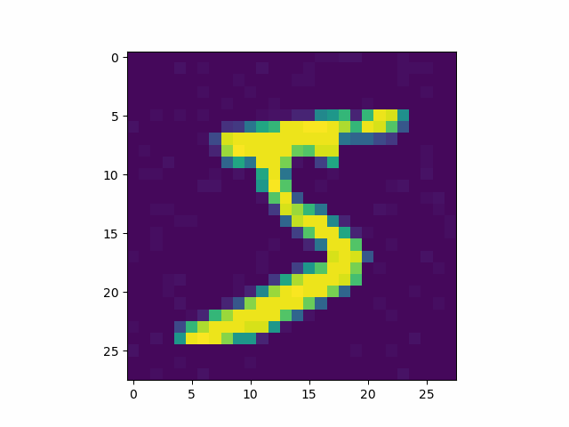

# Conditional Partial Diffusion MNIST

- Implementation of partial diffusion as described in fig 2 of https://arxiv.org/pdf/2302.12244.pdf
- gif above is from source image 5 partially diffused into an 8 at different switching times.
- Completed as part of a rotation project in Bradly Stadie's lab at Northwestern
